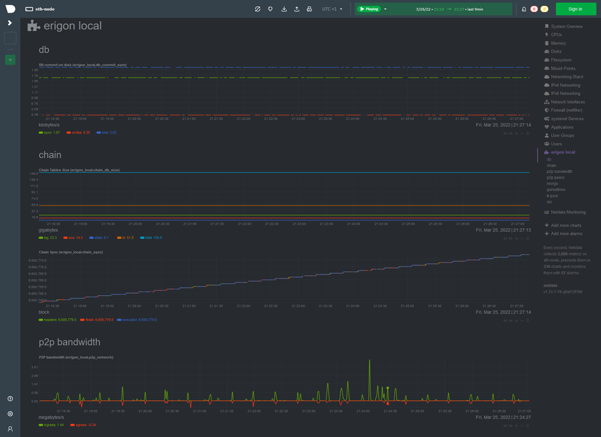

<!--
title: "Erigon monitoring with Netdata"
description: "Monitor the health and performance of Erigon Nodes (Ethereum client) with zero configuration, per-second metric granularity, and interactive visualizations."
custom_edit_url: https://github.com/netdata/go.d.plugin/edit/master/modules/erigon/README.md
sidebar_label: "Erigon"
-->

# Erigon monitoring with Netdata

[Erigon](https://github.com/ledgerwatch/erigon), formerly known as Turbo‐Geth, is a fork of Go Ethereum oriented toward speed and disk‐space efficiency. Erigon is a completely re-architected implementation of Ethereum with the goal of providing a faster, more modular, and more optimized implementation of Ethereum.

*This is a work-in-progress repository of the erigon module for the [netdata go.d.plugin](https://github.com/netdata/go.d.plugin).*



## Requirements

Run `erigon` with the flag `--metrics`. That will enable the metric server, with default port `6060` and
path `/debug/metrics/prometheus`.

## Charts

- Database
    - Syncs/Write per second
- Chain
    - Tables size (log/scs/state)
    - Chain Sync (headers/finish/execution)
- Peer-to-Peer
    - Bandwidth per second (ingress/egress)
    - Number of peers
    - Dials/Serves calls per second
- Reorgs
    - Total number of reorgs
- Number of active goroutines
- Transaction Pool
    - Pending
    - Queued
    - Current

## Configuration

Edit the `go.d/erigon.conf` configuration file using `edit-config` from the
Netdata [config directory](https://learn.netdata.cloud/docs/configure/nodes), which is typically at `/etc/netdata`.

```bash
cd /etc/netdata # Replace this path with your Netdata config directory
sudo ./edit-config go.d/erigon.conf
```

Needs only `url` to `erigon` metrics endpoint. Here is an example for 2 instances:

```yaml
jobs:
  - name: erigon_node_1
    url: http://203.0.113.10:6060/debug/metrics/prometheus

  - name: erigon_node_2
    url: http://203.0.113.11:6060/debug/metrics/prometheus
```

For all available options please see
module [configuration file](https://github.com/netdata/go.d.plugin/blob/master/config/go.d/erigon.conf).

## Troubleshooting

To troubleshoot issues with the `erigon` collector, run the `go.d.plugin` with the debug option enabled. The output should
give you clues as to why the collector isn't working.

First, navigate to your plugins directory, usually at `/usr/libexec/netdata/plugins.d/`. If that's not the case on your
system, open `netdata.conf` and look for the setting `plugins directory`. Once you're in the plugin's directory, switch
to the `netdata` user.

```bash
cd /usr/libexec/netdata/plugins.d/
sudo -u netdata -s
```

You can now run the `go.d.plugin` to debug the collector:

```bash
./go.d.plugin -d -m erigon
```

You can run `erigon` with the `--metrics.addr` flag to access the metrics remotely during debug:

```bash
erigon --metrics.port 6060 --metrics.addr 0.0.0.0
```
